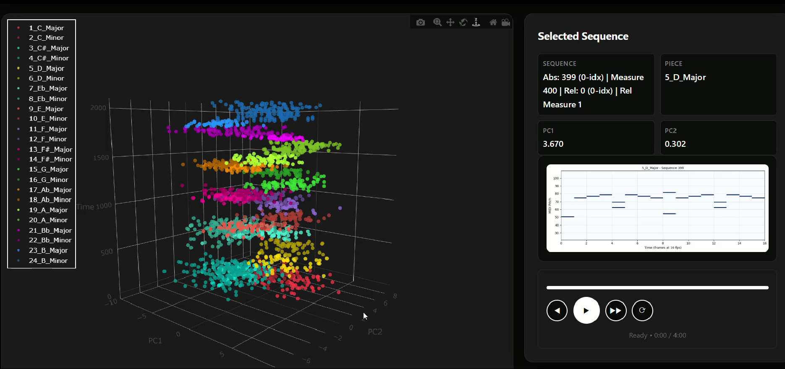
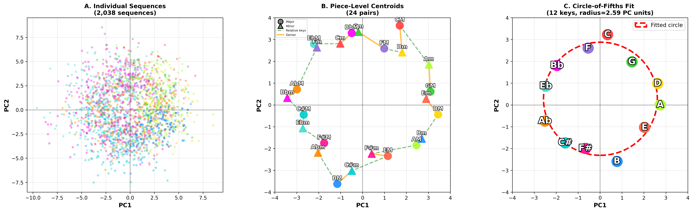
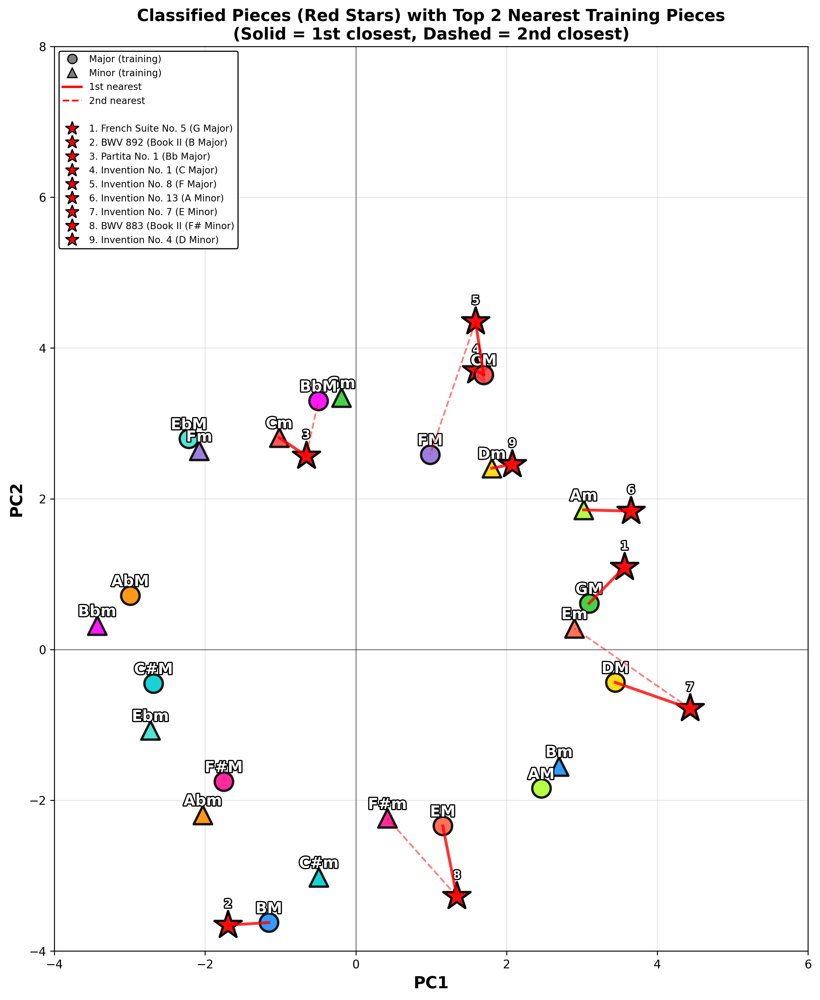

# Circle of Fifths as Latent Geometry in Bach's Preludes and Fugues

## Overview

This project demonstrates that unsupervised deep learning can spontaneously recover fundamental music-theoretic structure. We trained a simple feedforward autoencoder on J.S. Bach's *Well-Tempered Clavier*, Book I, and discovered that the learned latent space organizes pieces hierarchically into keys arranged in circle-of-fifths geometry.

---

## 🎹 [Interactive Demo: Bach Latent Space Explorer](https://music-intelligence-lab.github.io/bach-latent-circle-of-fifths/)

**Explore the latent space interactively with MIDI playback!**



---

## Key Findings

- **Hierarchical Organization**: Sequences naturally cluster into pieces, which cluster into keys
- **Circle of Fifths Emerges**: Key centroids form a near-perfect circle (CV = 8.5%) in 2D PCA space
- **Harmonic Function Encoded**: Close-tonic pairs (e.g., C Major and D Minor) are closer than relative pairs (e.g., C Major and A Minor), despite having more accidentals
- **No Supervision Required**: All structure emerges purely from reconstruction loss

## Installation

```bash
# Clone the repository
git clone https://github.com/Music-Intelligence-Lab/bach-latent-circle-of-fifths.git
cd bach-latent-circle-of-fifths

# Create virtual environment (recommended)
python -m venv venv
source venv/bin/activate  # On Windows: venv\Scripts\activate

# Install dependencies
pip install -r requirements.txt
```

Pre-trained weights can be found on Huggingface: https://huggingface.co/josephbakarji/bach-circle-of-fifths

## Paper Plots

The `paper_plots/` folder contains scripts to reproduce key figures from the paper:

### Hierarchical Clustering (Figure 2)

```bash
cd paper_plots
python hierarchical_clustering_plot.py
```

Generates a 3-panel visualization showing:
- **A. Individual Sequences**: 2,038 sequences colored by tonic
- **B. Piece-Level Centroids**: 24 pieces with relative key (green) and Dorian (orange) connections
- **C. Circle-of-Fifths Fit**: 12 key centroids with fitted circle



### Classification of Unseen Pieces

```bash
cd paper_plots
python classified_pieces_plot.py
```

Visualizes 9 test pieces (red stars) with connections to their nearest training pieces, demonstrating the model's ability to classify unseen Bach compositions.



### Data Files

The `paper_plots/` folder includes all necessary data to run the scripts:
- `processed_data/` - Sequence data (`all_sequences.npy`, indices, labels)
- `csv_data/centroids_pieces.csv` - 24 piece-level centroid coordinates
- `code/epoch113_loss0.0291.weights.h5` - Trained model weights
- `relative_key_distances.csv`, `wholetone_distances.csv` - Key relationship data

## MIDI Data

- **Original Data** (`original_data/`): 24 MIDI files from Bach's Well-Tempered Clavier, Book I (BWV 846-869)
- **Normalized Data** (`normalized_data/`): Same pieces normalized to 60 BPM for consistent encoding

## Model

- **Architecture**: Feedforward autoencoder (see `autoencoder.py`)
- **Latent dimension**: 128
- **Training loss**: 0.0291 (converged at epoch 113)
- **Weights**: `epoch113_loss0.0291.weights.h5`

```python
from autoencoder import build_autoencoder
from config import *

encoder, decoder, autoencoder = build_autoencoder()
autoencoder.load_weights('epoch113_loss0.0291.weights.h5')
```

## License

MIT License. Bach's compositions are in the public domain.

## Contact

- **Najla Sadek**: nss32@mail.aub.edu
- **Joseph Bakarji**: jb50@aub.edu.lb
- **Institution**: American University of Beirut, Lebanon
